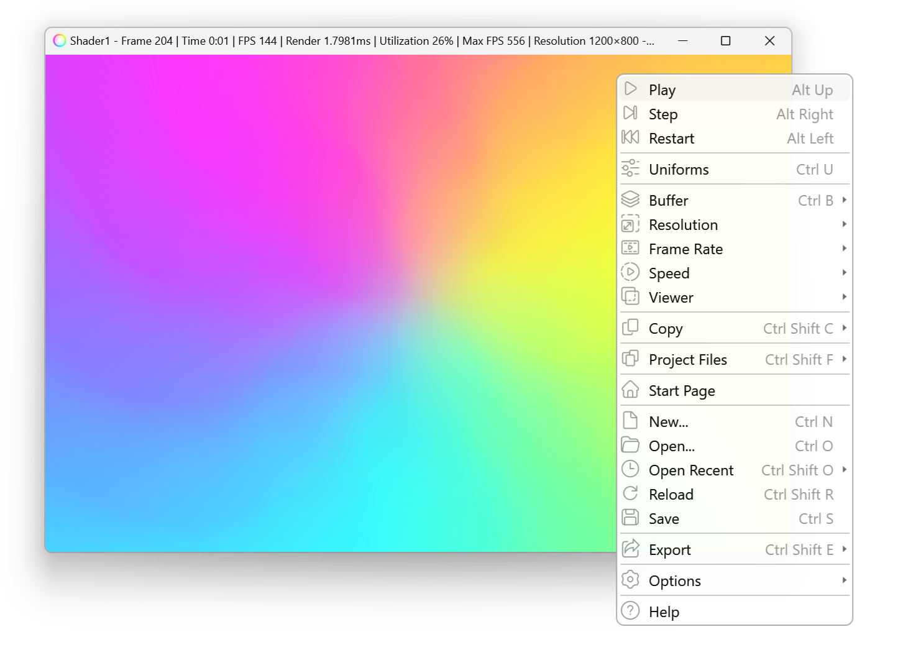
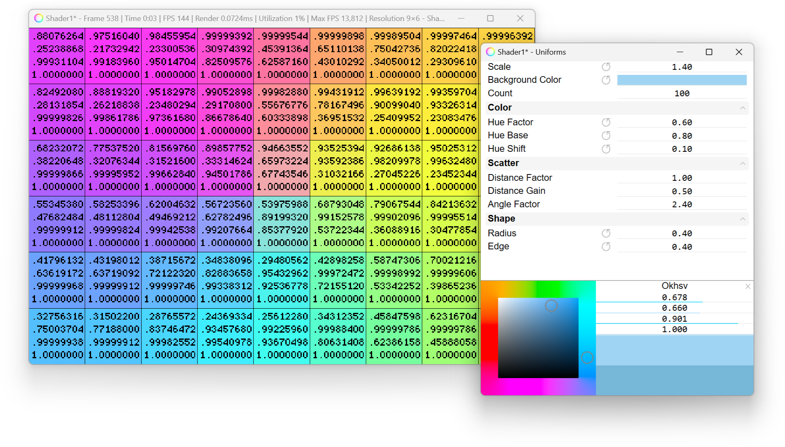

<h1> Shaderlens</h1>

### Shader Viewer

**Shaderlens** is an easy to use shader viewer, designed to make the process of writing shaders, and inspecting render results, as simple as possible.

Shaderlens is built to be compatible with [Shadertoy](https://www.shadertoy.com)'s main features and conventions. It runs a sequence of fragment shaders, each rendering to its own framebuffer, and referencing other framebuffers and textures. It also provides compatible input texture, and built-in uniforms.

It supports source files hot reload, making it easy to work with any code editor.


<p align="center"><i>Main options</i></p>


### Features
- Compatibility with Shadertoy.
- Source files hot reload.
- Render resolution, frame rate, and speed control.
- Intermediate passes buffers view.
- Pixel level inspection with scaling, panning and custom overlays.
- Project templates.
- Uniforms editor.
- Image sequence export, clipboard copy.
- Optional C# and Visual Studio workflow.
- Responsive UI, customizable inputs, themes.


<p align="center"><i>Uniforms, and scaled pixel values</i></p>


## Getting Started

1. Download the [latest release binaries](https://github.com/ytt0/shaderlens/releases/latest).

2. Extract the files to any folder, and run **Shaderlens.exe**.

3. At the start page, click `New...` and create a new project.

4. Edit the project files with your favorite code editor, save to automatically re-compile the shader and see the results.

5. Right click on the viewport to open the main menu.  
  Drag `Ctrl + Mouse Middle Button` to scale, and `Mouse Middle Button` to pan.

6. Refer to the [documentation](https://ytt0.github.io/shaderlens), for details about available features, inputs, and extending the project with more passes and textures.


## Documentation and Examples

Documentation can be found [here](https://ytt0.github.io/shaderlens).  
Project examples can be found under the [examples](https://github.com/ytt0/shaderlens/tree/main/examples) folder.


## Build from Source
- Prerequisite - Make sure **WPF** and **.net 8.0** components are available in Visual Studio.  
  Open "Visual Studio Installer", and click "Modify":
  - Under the "Workload" tab, make sure "**.NET desktop development**" is checked.
  - Under the "Individual Components" tab, make sure "**.NET 8.0 Runtime (Long Term Support)**" is checked.
- Clone the repository:
  ```
  git clone https://github.com/ytt0/shaderlens
  ```
- Build with dotnet:
  ```
  dotnet build
  ```
    - Open `src\Shaderlens.App\bin\Debug\net8.0-windows\Shaderlens.exe`.

  Alternatively use the publish target:
  ```
  dotnet publish
  ```
    - Open `bin\Release\Shaderlens.exe`.

- Build with Visual Studio:  
  Open `Shaderlens.sln`, select `Shaderlens.App` as a Startup Project, and press F5.


## License

The code in this repository is licensed under the [MIT license](LICENSE).  
The documentation is licensed under the [CC0 license](docs/LICENSE).
